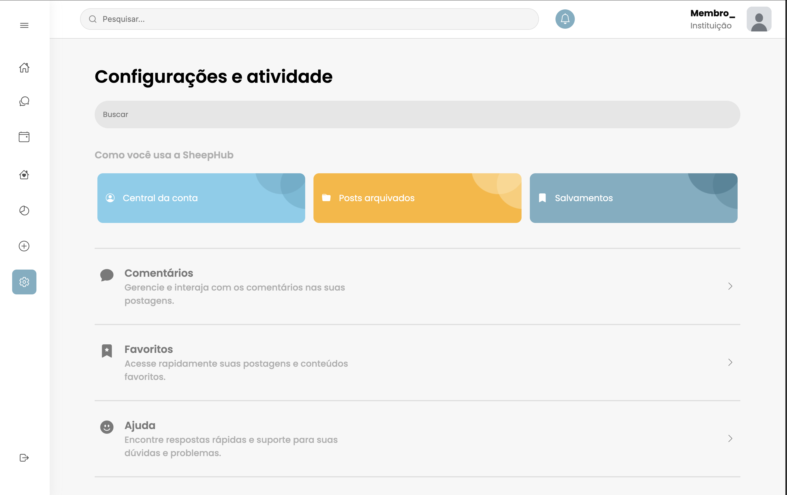

# Página de configurações (Projeto SheepHub)

---

### Descrição

A página de Configurações e Atividade do SheepHub reúne, em um único espaço, todas as ferramentas que o membro precisa para organizar sua experiência dentro da plataforma. O layout destaca atalhos visuais para a Central da Conta, Posts Arquivados e Salvamentos, criando uma navegação fluida que conduz o usuário pelos pontos mais importantes do seu uso diário.

Logo abaixo, surgem seções dedicadas a Comentários, Favoritos e Ajuda, cada uma apresentada com ícones suaves e descrições claras que orientam sem pesar. A estrutura respira leveza, com espaçamentos amplos e cores que ecoam a identidade visual do projeto.

Essa interface foi desenvolvida como parte do TCC SheepHub, reforçando a proposta de criar uma rede social intuitiva, organizada e acolhedora para instituições religiosas e seus membros.

---
